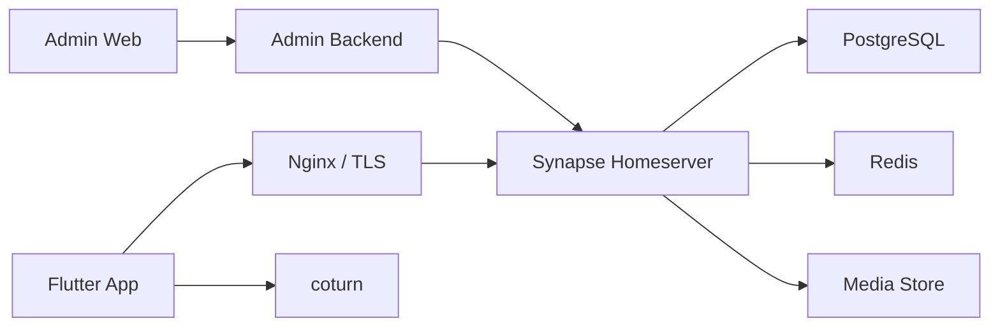

# Architecture

## Overview

本项目采用 Matrix 协议生态实现私有化 IM。

## Why Not From Scratch

IM 的复杂度不在聊天输入框，而在协议一致性、离线消息、多端同步、端到端加密、设备密钥、推送、群组状态、文件存储、音视频中继和运维调优。

Matrix 已经解决了核心协议和客户端同步问题，Synapse 提供成熟服务端实现，Flutter Matrix SDK 提供多端客户端基础能力。

## Deployment Modes

### Local Mode

- Synapse: `http://localhost:8008`
- PostgreSQL: Docker 内部访问
- Redis: Docker 内部访问
- coturn: `localhost:3478`
- Nginx: 可选，本地使用 profile 启动

本地阶段不绑定域名，先验证登录、聊天、群聊、媒体、后台管理闭环。

### MVP Mode

- 单台 Synapse
- PostgreSQL
- Redis
- Nginx
- coturn

适合内测和小规模试点。

### Production Mode

- Synapse worker 拆分
- PostgreSQL 主从或托管数据库
- 独立媒体存储
- 独立 TURN 节点
- Admin Backend 独立部署
- 监控与日志系统

适合几千到几万人规模。

## Security Principles

- 默认不开公开注册。
- 默认不开 Matrix federation。
- 管理后台不直接暴露 Synapse 管理员 Token。
- App 不调用 Synapse Admin API。
- `/_synapse/admin/*` 只允许后台服务通过内网访问。
- 密钥、数据库密码、TURN secret 通过环境变量或密钥管理系统注入。
- 端到端加密开启后，服务端无法读取聊天明文。
